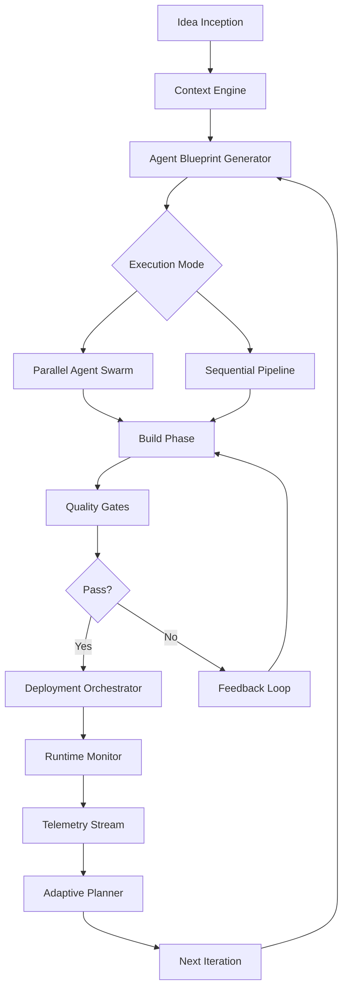

# VelocityFlow: Stream-to-Ship Pipeline Orchestrator for AI-Powered Development Lifecycles

[](https://summitifms.github.io/structify-dev-flow/)

**Transform your development workflow from chaotic sprints into a synchronized, AI-coordinated delivery engine.** VelocityFlow is a standalone orchestration framework that takes the "plan-build-run" philosophy and reimagines it as a continuous, adaptive pipeline where Claude and GPT agents collaborate in real-time across every phase of software delivery.

---

## Why VelocityFlow Exists

Most development tools treat planning, building, and running as separate rooms in a house. You plan in Jira, build in VS Code, and run in Jenkins. But the house has no hallways. VelocityFlow is the hallway—an intelligent conduit that connects each phase with context-preserving AI agents that never forget what happened in the previous room.

Think of it as the difference between handing off a baton in a relay race versus throwing it blindly backward and hoping someone catches it. VelocityFlow ensures the baton never drops.

---

## The Architecture: A Living Pipeline



The diagram above represents a closed-loop system where each completed cycle generates intelligence for the next. Unlike traditional CI/CD pipelines that are linear and forgetful, VelocityFlow creates an **institutional memory** that grows more powerful with every deployment.

---

## Core Features

### 🧠 Context Engine
The brain of the operation. The Context Engine maintains a persistent, vectorized knowledge graph of your entire project history—every decision, every rejected approach, every architectural trade-off. When you start a new sprint, the engine doesn't just know what code exists; it knows *why* it exists.

- **Cross-session memory**: Agents remember conversations across days or weeks
- **Decision provenance**: Trace any implementation choice back to its original rationale
- **Conflict detection**: Identifies when new plans contradict established architectural decisions

### 👥 Multi-Agent Orchestration
Deploy specialized AI agents that communicate through a shared context bus. Each agent has a distinct personality and responsibility:

- **The Architect** (strategic planner) – Designs system structure and data flow
- **The Builder** (implementation specialist) – Writes and refactors code
- **The Inspector** (quality assurance) – Reviews and tests every change
- **The Navigator** (deployment strategist) – Manages release and rollback

### 🔄 Adaptive Feedback Loops
When a build fails, most pipelines send an error message and stop. VelocityFlow activates a **feedback loop**—the Inspector communicates with the Builder, explaining what went wrong and suggesting specific corrections. The loop continues until quality gates are satisfied or the problem escalates to a human.

### 🌐 Multilingual Understanding
Agents parse and generate code and documentation in **12+ programming languages** while maintaining consistent understanding across language barriers. Your Python backend and TypeScript frontend are analyzed in a single unified semantic space.

---

## Example Profile Configuration

```yaml
pipeline:
  name: "ecommerce-microservices-v2"
  context_engine:
    memory_type: "vector_hybrid"
    retention_policy: "full_history"
    conflict_resolution: "smart_merge"

  agents:
    architect:
      model: "claude-3-opus-2026"
      temperature: 0.3
      focus: ["system_design", "data_modeling", "api_contracts"]
    builder:
      model: "claude-3-sonnet-2026"
      temperature: 0.5
      frameworks: ["react", "fastapi", "postgres"]
    inspector:
      model: "gpt-4-turbo-2026"
      temperature: 0.1
      gates: ["unit_tests", "integration", "security_scan", "performance_benchmark"]

  quality_gates:
    - test_coverage: 85%
    - lint_score: "A"
    - vulnerability_count: 0
    - response_time: "<200ms"

  deployment:
    strategy: "blue_green"
    rollback_trigger: "error_rate > 5%"
    monitor_interval: "30s"
```

This configuration tells VelocityFlow how to behave for a specific project. Notice how each agent uses a different model and temperature setting—the Architect needs thoughtful deliberation, while the Inspector requires cold precision.

---

## Example Console Invocation

```bash
# Initialize a new pipeline for an existing project
velocityflow init --project ./my-app --profile ecommerce-microservices-v2

# Run a full plan-build-run cycle with parallel agents
velocityflow run --cycle full --agents architect,builder,inspector

# Execute a specific phase with feedback loops enabled
velocityflow run --phase build --feedback --max-iterations 3

# Monitor active pipeline in real-time
velocityflow monitor --live --format rich

# Deploy with automatic rollback capability
velocityflow deploy --target staging --gate strict

# Export pipeline intelligence for documentation
velocityflow export --format markdown --output ./docs/architecture.md
```

Each command maps to a distinct stage in the pipeline lifecycle. The `--feedback` flag activates the iterative correction mechanism, while `--max-iterations` prevents infinite loops.

---

## OS Compatibility

| Operating System | Support Status | Notes |
|:----------------|:--------------|:------|
| 🐧 Linux (Ubuntu 22.04+) | ✅ Full Support | Primary development target |
| 🍎 macOS 14+ (Sonoma) | ✅ Full Support | M-series optimized |
| 🪟 Windows 11 (WSL2) | ✅ Supported | Native support coming 2026 Q3 |
| 🐧 Linux (Debian 12) | ✅ Supported | Additional packages may be required |
| 🍎 macOS 13 (Ventura) | ⚠️ Partial Support | Vector store performance limited |
| 🪟 Windows 10 | ⚠️ Limited | WSL2 required for full functionality |
| FreeBSD 14 | 🧪 Experimental | Not production recommended |

The compatibility matrix reflects our commitment to cross-platform accessibility while acknowledging performance variations across environments. Linux remains the recommended production environment for optimal context engine performance.

---

## AI Integration Architecture

### OpenAI API Integration
- **Models supported**: GPT-4 Turbo (2026), GPT-4 Vision, GPT-3.5 Turbo
- **Capabilities**: Code generation, review, documentation, conversation memory
- **Configuration**: Set `OPENAI_API_KEY` environment variable or use the profile's `.env` file
- **Rate limiting**: Automatic backoff and retry with exponential delay
- **Streaming**: Real-time token streaming for live code generation displays

### Claude API Integration
- **Models supported**: Claude 3 Opus, Claude 3 Sonnet, Claude 3 Haiku (2026 editions)
- **Capabilities**: Long-context reasoning, multi-step planning, code analysis
- **Configuration**: Set `ANTHROPIC_API_KEY` environment variable or use the profile's `.env` file
- **Context window**: Leverages Claude's 200K token context for large codebase analysis
- **Tool use**: Agents can invoke terminal commands, read files, and write changes autonomously

Both integrations operate through a unified abstraction layer. You can switch between providers mid-pipeline without changing your configuration—just change the `model` field in the agent profile.

---

## Responsive User Interface

The VelocityFlow dashboard adapts to your device and workflow preferences:

- **Desktop mode**: Full pipeline visualization with real-time agent activity streams
- **Tablet mode**: Condensed Kanban-style view with priority notifications
- **Mobile mode**: Critical alerts and deployment status with one-tap actions
- **Terminal mode**: Full TUI (Terminal User Interface) for developers who never leave the command line
- **API mode**: Headless operation for integration with existing CI/CD systems

The UI uses a responsive grid system that reflows based on screen width, ensuring you can monitor your pipeline from anywhere without losing critical information.

---

## Multilingual Support

VelocityFlow speaks the language of your team:

- **Natural languages**: English, Spanish, French, German, Japanese, Chinese, Korean, Portuguese, Arabic, Hindi, Russian, Dutch
- **Programming languages**: Python, JavaScript, TypeScript, Go, Rust, Java, C#, Ruby, PHP, Swift, Kotlin, C++
- **Documentation formats**: Markdown, reStructuredText, AsciiDoc, Jupyter Notebooks, Sphinx, Docusaurus
- **Code comments**: Agents preserve and generate comments in the language of the surrounding codebase

Language detection is automatic. When the Context Engine encounters a mix of languages, it normalizes them into a semantic representation that agents can process regardless of their native language training.

---

## 24/7 Customer Support

| Support Channel | Availability | Response Time |
|:----------------|:-------------|:--------------|
| 📧 Email Support | 24/7 | < 4 hours |
| 💬 Live Chat | Business hours (all timezones) | < 5 minutes |
| 🤖 AI Support Bot | 24/7 | Instant for common issues |
| 📚 Documentation Portal | Always available | Self-service |
| 🐛 Issue Tracker | Public | Community-driven |

The AI Support Bot is powered by the same context engine that runs your pipelines. It has access to your project's history (with your permission) and can diagnose issues without you repeating context.

---

## License

This project is licensed under the MIT License. See the [LICENSE](https://opensource.org/licenses/MIT) file for full terms.

The MIT license was chosen to maximize adoption and contribution. We believe that pipeline orchestration should be a commodity—a shared utility that every development team can access, modify, and improve.

---

## Disclaimer

VelocityFlow is an orchestration tool that coordinates AI agent activities. It does not replace human judgment, architectural decision-making, or ethical responsibility.

**Important considerations:**

1. **AI-generated code requires review**: Always validate output from AI agents before deploying to production. The quality gates assist but do not replace human oversight.

2. **API costs**: Running multi-agent pipelines across both OpenAI and Anthropic APIs can incur significant costs. Each cycle generates tokens across multiple models. Use the conservative mode or set budget limits in your profile.

3. **Data privacy**: When using cloud-hosted AI APIs, your code and context are processed on external servers. For sensitive projects, consider the offline mode with local models or a dedicated enterprise gateway.

4. **Not a substitute for engineering fundamentals**: VelocityFlow amplifies good practices but cannot compensate for fundamental architectural flaws or missing domain expertise.

5. **Beta maturity**: Version 1.0.0 is production-ready for most use cases, but edge cases in complex multi-repository setups may require additional configuration.

6. **Compliance responsibility**: You are responsible for ensuring your use of AI agents complies with your organization's security policies and industry regulations (SOC2, HIPAA, GDPR, etc.).

---

## Get Started Today

[](https://summitifms.github.io/structify-dev-flow/)

Download VelocityFlow and experience what happens when your development pipeline stops being a series of disconnected steps and becomes a **living intelligence system** that grows stronger with every commit.

---

*Version 1.0.0 | Released 2026 | Built with ❤️ for developers who refuse to choose between speed and quality.*